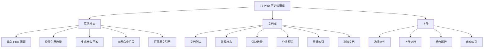
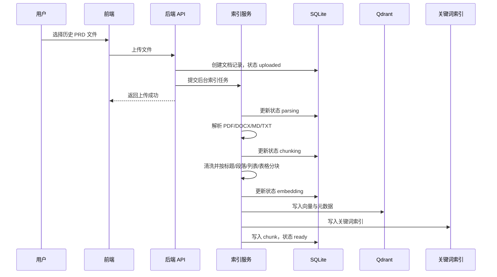
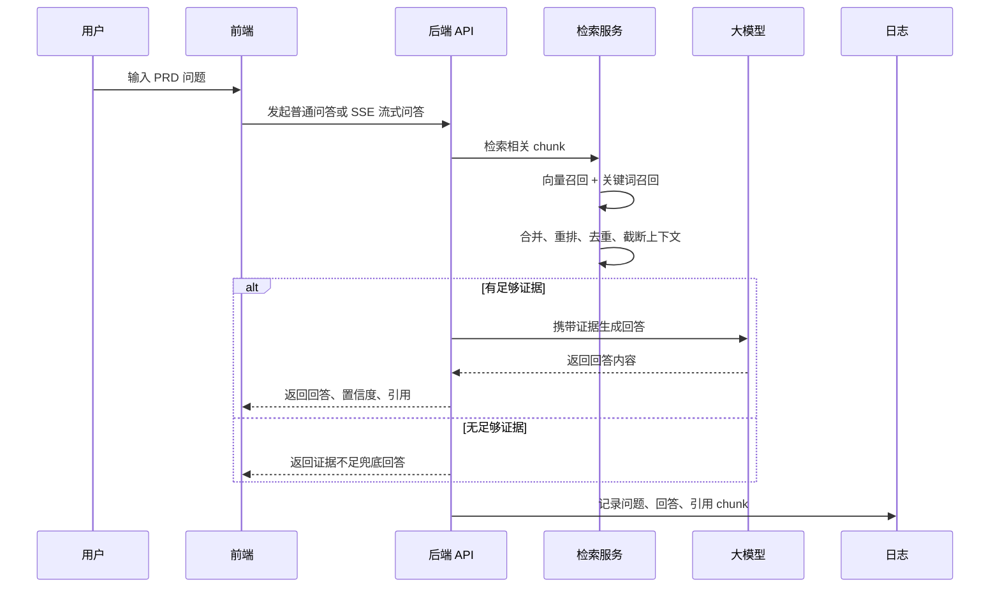

# T3 PRD 历史知识库产品需求文档

## 1. 产品概述

### 1.1 产品名称

T3 PRD 历史知识库

### 1.2 产品定位

面向产品经理、业务分析师、项目协作方的私有化 PRD 知识检索与写作参考工具。系统通过导入历史 PRD、需求文档和复盘材料，自动完成解析、清洗、分块、向量索引与关键词索引，让使用者在撰写新 PRD 时可以快速查询历史写法、复用产品口径，并查看每条回答背后的原文依据。

### 1.3 一句话说明

把散落在历史文档里的产品背景、规则描述、策略口径和功能拆解，变成可追溯、可引用、可复用的 PRD 写作参考库。

## 2. 背景与问题

### 2.1 业务背景

产品团队在长期迭代中积累了大量 PRD、策略文档、外呼话术、复盘报告等材料。这些材料沉淀了大量可复用信息，例如历史业务规则、需求背景写法、策略配置说明、异常处理口径、功能边界定义等。

但在实际写新需求时，历史知识通常分散在不同文档、不同版本和不同成员的本地资料中，查找成本高，复用不稳定。新人或跨团队协作成员往往需要反复询问资深同学，容易出现写法不统一、历史约束遗漏、重复造轮子等问题。

### 2.2 当前痛点

1. 历史 PRD 查找成本高  
   需要人工在多个文件夹、聊天记录或知识库中搜索，难以快速定位与当前需求相关的片段。

2. 历史写法难复用  
   即使找到了文档，也需要人工阅读整篇内容，提炼背景、规则和表达方式。

3. 回答缺少证据链  
   直接使用大模型总结容易产生幻觉，产品决策和 PRD 表达需要能回到原文确认。

4. 文档质量难调试  
   上传后的解析、清洗、分块结果如果不可见，检索效果不好时很难判断问题出在文档、切分还是召回。

5. 团队知识沉淀不足  
   历史经验依赖个人记忆，无法稳定转化为团队可访问的产品资产。

## 3. 产品目标

### 3.1 核心目标

建设一个单机私有化的 PRD 历史知识库 MVP，支持历史文档导入、自动索引、自然语言检索问答、引用溯源和文档分块调试，帮助产品同学提升 PRD 写作效率与历史口径一致性。

### 3.2 业务目标

1. 降低历史 PRD 查询成本，让常见历史写法在 1 分钟内可被找到。
2. 提高新 PRD 写作效率，减少重复翻文档和口头询问。
3. 提升产品表达一致性，避免同类业务规则在不同文档中反复变形。
4. 降低大模型回答风险，确保关键结论具备原文引用。
5. 为后续团队级知识库、权限管理和多业务域沉淀打基础。

### 3.3 非目标

MVP 阶段不解决以下问题：

1. 不做多人权限、组织架构、文档级访问控制。
2. 不做 OCR，扫描版 PDF 暂不保证可解析。
3. 不做复杂表格语义理解，只做基础表格抽取与文本化。
4. 不直接替代 PRD 编辑器，不提供完整 PRD 在线协同写作。
5. 不承诺模型可以给出证据外的行业经验或业务判断。

## 4. 用户与场景

### 4.1 目标用户

| 用户角色 | 核心诉求 | 典型问题 |
| --- | --- | --- |
| 产品经理 | 写新 PRD 时查历史写法和规则口径 | “类似功能以前怎么描述？” |
| 新入职产品同学 | 快速理解历史业务逻辑和文档表达方式 | “这个业务背景以前怎么写？” |
| 业务/运营同学 | 查找历史策略、话术、流程约束 | “AI 外呼策略之前有哪些规则？” |
| 研发/测试同学 | 追溯需求依据和原始文档片段 | “这个规则来自哪份文档？” |
| 产品负责人 | 推动知识沉淀和口径统一 | “团队历史经验是否可复用？” |

### 4.2 核心使用场景

#### 场景一：写 PRD 时查询历史背景写法

产品经理正在编写一个新需求，需要参考历史 PRD 中“产品背景”和“业务价值”的表达方式。用户在问答页输入：“历史 PRD 里，产品背景一般怎么写？”系统检索相关历史片段，生成结构化总结，并展示命中文档和原文摘录。

#### 场景二：复用历史业务规则

产品经理要设计线索二次、三次呼叫策略，希望确认历史策略配置规则。用户输入问题后，系统返回相关规则描述、条件判断、异常说明，并给出引用片段，用户可点击查看完整 chunk 原文。

#### 场景三：导入历史文档沉淀知识

团队将已定稿或已上线版本的 PRD 上传到系统。系统自动解析文档、清洗文本、按语义边界切分并建立索引。文档库页面显示处理状态和分块数量。

#### 场景四：排查检索质量

用户发现某个问题没有召回期望内容，于是在文档库中打开对应文档的分块预览，检查标题识别、表格抽取、切片长度和片段完整性，并决定是否重建索引或优化源文档。

## 5. 产品方案

### 5.1 产品形态

产品采用前后端分离的 Web 应用形态，默认面向团队内部单机部署。

前端提供三个核心工作区：

1. 写法检索  
   面向日常 PRD 写作查询，支持自然语言提问、流式回答、引用数量调整、引用原文查看。

2. 文档库  
   面向知识库管理与质量调试，支持文档状态查看、分块预览、重建索引、删除文档。

3. 上传  
   面向知识沉淀，支持上传 PDF、DOCX、Markdown、TXT 文档并自动建立索引。

后端提供文档管理、异步索引、混合检索、模型问答、SSE 流式输出、引用详情查询等能力。

### 5.2 信息架构

### 5.3 核心体验原则

1. 证据优先  
   回答必须基于历史文档片段生成，关键结论应尽量附带引用编号。没有证据时明确拒答或说明证据不足。

2. 写作友好  
   回答不是简单列搜索结果，而是把历史 PRD 中的表达方式归纳为可参考的背景、规则、功能拆解或注意事项。

3. 可追溯  
   每条命中片段应展示来源文档、标题、页码、得分和摘录，并支持查看完整原文 chunk。

4. 可调试  
   文档上传后不仅展示成功失败，还要能看到分块结果，便于判断知识库质量。

5. 低门槛  
   MVP 不要求用户理解向量数据库、embedding、rerank 等技术概念，主要操作应围绕“上传、提问、看引用、管理文档”展开。

### 5.4 核心流程

#### 5.4.1 文档导入与索引流程

流程规则：

1. 支持文件类型：PDF、DOCX、Markdown、TXT。
2. 上传成功后立即返回，索引在后台异步执行。
3. 文档状态至少包括 uploaded、parsing、chunking、embedding、ready、failed。
4. 解析失败或索引失败时，应在文档库展示错误原因。
5. 重建索引时，先清理旧 chunk、旧向量和旧关键词索引，再写入新索引。
6. 删除文档时，需要同步删除原始文件、数据库 chunk、向量数据和关键词索引。

#### 5.4.2 PRD 写法检索流程

流程规则：

1. 用户问题最长 4000 字。
2. 用户可设置引用数量，MVP 支持 1-10 个引用。
3. 系统默认启用流式生成，降低等待感。
4. 检索无结果或低于阈值时，不强行生成，应提示知识库未收录或证据不足。
5. 回答需要返回置信度，用于提示当前结果可信程度。
6. 引用列表需要和回答同时返回，便于用户核验。

### 5.5 功能模块方案

#### 5.5.1 写法检索模块

目标：让用户用自然语言快速找到历史 PRD 中可复用的写法与依据。

页面组成：

| 区域 | 内容 | 说明 |
| --- | --- | --- |
| 页面头部 | 可检索 PRD 数、命中片段数 | 让用户知道当前知识库规模和本次召回情况 |
| 提问区 | 文本输入框、示例问题、引用数量、流式开关、提交按钮 | 降低首次使用成本 |
| 回答区 | 历史写法总结、置信度、兜底说明 | 承载最终可复用内容 |
| 证据区 | 命中文档、分数、标题、页码、摘录 | 支持用户追溯 |
| 引用弹窗 | 完整 chunk 原文、来源文档、位置 | 支持核验和复制参考 |

关键交互：

1. 用户点击示例问题后，系统直接发起检索。
2. 用户提交问题后，回答区先清空，并进入生成中状态。
3. 流式模式下，答案逐字或分片展示；完成后展示引用元信息。
4. 命中片段卡片可点击，打开引用弹窗。
5. 如果接口报错，页面展示错误提示，不吞掉异常。

回答内容要求：

1. 优先给结论，再补充必要说明。
2. 尽量形成可直接参考的 PRD 表达结构，例如背景、目标、规则、边界、风险。
3. 每个关键结论尽量标注引用编号。
4. 不补充证据之外的业务事实。
5. 对证据只覆盖一部分的问题，需要明确说明缺口。

#### 5.5.2 文档库模块

目标：让用户管理已导入文档，并排查索引质量。

页面组成：

| 区域 | 内容 | 说明 |
| --- | --- | --- |
| 文档列表 | 文件名、类型、状态、分块数、更新时间、操作 | 管理知识库资产 |
| 状态标识 | uploaded/parsing/chunking/embedding/ready/failed | 展示处理进度 |
| 操作按钮 | 查看分块、重建索引、删除 | 支持管理与修复 |
| 分块预览 | chunk 序号、类型、标题、长度、offset、页码、原文 | 便于检索质量调试 |

关键交互：

1. 页面定时刷新文档状态，用户无需手动等待。
2. 文档 ready 后可被问答检索使用。
3. failed 状态需要展示错误原因。
4. 重建索引时，如果当前文档已有索引任务在运行，应提示任务已存在。
5. 删除文档前需要二次确认。
6. 正在索引中的文档不允许删除，避免索引数据不一致。

分块预览要求：

1. 展示 chunk 在原文中的 start_offset 和 end_offset。
2. 展示 page_no 和 section_title，帮助定位来源。
3. 展示 block_types，帮助判断该片段来自标题、正文、列表还是表格。
4. 展示完整 chunk 内容，方便判断切分是否过短、过长或断句不合理。

#### 5.5.3 上传模块

目标：让用户将历史 PRD 快速沉淀为可检索知识。

页面组成：

| 区域 | 内容 | 说明 |
| --- | --- | --- |
| 文件选择区 | 支持拖拽/选择文件 | MVP 已支持选择上传 |
| 类型说明 | PDF、DOCX、Markdown、TXT | 明确可上传范围 |
| 上传按钮 | 上传并建立索引 | 触发后端异步任务 |
| 结果提示 | 上传成功、文档 ID、失败原因 | 让用户知道是否进入索引流程 |

上传规则：

1. 仅允许指定扩展名文件。
2. 建议上传已定稿或已上线版本，避免草稿污染知识库。
3. 同名文件 MVP 不做自动版本合并，按独立文档处理。
4. 上传成功不代表可检索，只有索引完成且状态 ready 后才可检索。

#### 5.5.4 引用溯源模块

目标：让用户知道每条回答依据来自哪里，降低幻觉风险。

展示字段：

| 字段 | 说明 |
| --- | --- |
| chunk_id | 知识片段唯一标识 |
| document_id | 文档唯一标识 |
| filename | 来源文件 |
| page_no | PDF 页码或空 |
| section_title | 所属标题路径 |
| excerpt | 命中摘录 |
| score | 检索得分 |
| content | 完整原文片段 |

规则：

1. 回答区和证据区的引用顺序应一致。
2. 用户点击引用后应看到完整原文，而不是只有摘要。
3. 引用原文不做二次改写，保持证据真实性。

### 5.6 检索与生成策略

#### 5.6.1 文档解析策略

1. PDF：提取文本块，按页面顺序、坐标排序；基础抽取表格并转为 Markdown 表格。
2. DOCX：识别标题样式、疑似标题、列表和表格。
3. Markdown：识别标题层级、段落和列表。
4. TXT：按空行切分为段落。
5. 所有文本进入索引前统一清洗，去除无效空白与异常字符。

#### 5.6.2 分块策略

1. 默认 chunk_size 为 800 字，chunk_overlap 为 100 字。
2. 单个 chunk 最小 120 字，最大 800 字。
3. 分块时保留 section_title、section_level、block_types、source_order、offset 等元数据。
4. 标题、列表、表格作为重要结构信号进入 chunk 元数据。
5. 分块目标不是机械切字，而是尽量保留一个可被模型理解的语义片段。

#### 5.6.3 召回策略

系统采用混合召回：

1. 向量召回  
   使用 embedding 模型将问题和文档片段映射为向量，通过 Qdrant 检索语义相近片段。

2. 关键词召回  
   使用本地关键词索引补充召回，提升对专有名词、业务词、功能名、策略名的命中能力。

3. 合并去重  
   以 chunk_id 合并向量和关键词结果，避免同一片段重复出现。

4. 规则重排  
   综合向量得分、关键词得分和词面重合度进行重排。

5. 阈值过滤  
   低于相似度或重排阈值的结果不进入最终上下文。

6. 上下文截断  
   按最大上下文字数截断，避免过多引用导致模型输入膨胀。

#### 5.6.4 生成策略

1. 系统提示词明确要求模型只能依据参考证据回答。
2. 无相关证据时返回固定兜底话术：“知识库未收录相关内容，或现有证据不足以支持回答。”
3. 部分证据可支持时，回答可覆盖已支持部分，并说明未覆盖内容。
4. 回答语言为简洁中文，适合产品同学直接阅读和复用。
5. 支持普通接口和 SSE 流式接口两种回答方式。

### 5.7 数据对象

#### 5.7.1 Document

| 字段 | 说明 |
| --- | --- |
| id | 文档唯一 ID |
| filename | 原始文件名 |
| file_type | 文件类型 |
| storage_path | 原始文件存储路径 |
| status | 索引状态 |
| error_message | 失败原因 |
| created_at | 创建时间 |
| updated_at | 更新时间 |

#### 5.7.2 Chunk

| 字段 | 说明 |
| --- | --- |
| id | chunk 唯一 ID |
| chroma_id | 向量库写入 ID，当前命名保留历史字段 |
| document_id | 所属文档 |
| content | 原文片段 |
| page_no | 页码 |
| section_title | 标题路径 |
| start_offset | 起始位置 |
| end_offset | 结束位置 |
| created_at | 创建时间 |

#### 5.7.3 ChatLog

| 字段 | 说明 |
| --- | --- |
| question | 用户问题 |
| answer | 系统回答 |
| confidence | 置信度 |
| fallback_reason | 兜底原因 |
| retrieved_chunk_ids | 引用 chunk 列表 |

### 5.8 接口方案

| 接口 | 方法 | 用途 |
| --- | --- | --- |
| `/api/documents/upload` | POST | 上传文档并启动索引 |
| `/api/documents` | GET | 获取文档列表 |
| `/api/documents/{id}` | GET | 获取文档详情 |
| `/api/documents/{id}/chunks` | GET | 获取文档分块 |
| `/api/documents/{id}/reindex` | POST | 重建索引 |
| `/api/documents/{id}` | DELETE | 删除文档 |
| `/api/chat` | POST | 普通问答 |
| `/api/chat/stream` | GET | 流式问答 |
| `/api/chunks/{chunk_id}` | GET | 获取引用片段详情 |

### 5.9 状态与异常方案

#### 文档状态

| 状态 | 含义 | 用户可见动作 |
| --- | --- | --- |
| uploaded | 已上传，等待处理 | 等待或刷新 |
| parsing | 正在解析 | 等待 |
| chunking | 正在分块 | 等待 |
| embedding | 正在向量化并写入索引 | 等待 |
| ready | 已可检索 | 提问、查看分块、重建、删除 |
| failed | 处理失败 | 查看错误、重建、删除 |

#### 异常处理

1. 不支持的文件类型：上传接口返回错误，前端展示原因。
2. 文档解析无内容：状态置为 failed，展示“未提取到可用文本”。
3. 嵌入或模型调用失败：问答接口返回错误，前端展示请求失败信息。
4. 检索无相关证据：返回兜底回答，不进入生成幻觉。
5. 删除运行中文档：返回冲突错误，提示等待索引完成。

## 6. 交互与页面要求

### 6.1 全局布局

产品采用左侧导航 + 右侧工作区布局。

左侧包含：

1. 产品名称和定位说明。
2. 知识库统计：历史文档数、知识分块数。
3. 主导航：写法检索、文档库、上传。
4. 最近可检索历史 PRD 列表。

右侧根据当前导航展示对应工作区。

### 6.2 写法检索页

页面默认作为首屏，突出“输入问题并得到可引用回答”的核心任务。

验收点：

1. 首次进入可看到示例问题。
2. 无文档或无引用时，证据区展示空状态。
3. 生成中按钮不可重复提交。
4. 引用数量滑杆范围为 1-10。
5. 回答完成后展示置信度和命中片段数。

### 6.3 文档库页

页面用于管理知识库资产。

验收点：

1. 文档列表按创建时间倒序展示。
2. 每条文档展示状态、类型、分块数、更新时间。
3. 查看分块后在页面下方展示 chunk 预览。
4. 删除操作有二次确认。
5. failed 状态展示错误信息。

### 6.4 上传页

页面用于导入新文档。

验收点：

1. 未选择文件时提交，提示选择文件。
2. 上传中按钮展示 loading 状态。
3. 上传成功展示文档 ID 或成功提示。
4. 上传成功后刷新文档列表。

## 7. 权限与安全

MVP 为单机私有部署，不做账号体系，但仍需遵守以下原则：

1. 文档存储在本地 backend/storage/raw。
2. 元数据和聊天记录存储在本地 SQLite。
3. 向量索引存储在本地或本机 Qdrant。
4. 模型调用依赖 DashScope，需要通过环境变量配置 API Key。
5. 不应将用户上传文档写入公开外部服务，除必要的模型 embedding 与生成调用外。

后续团队化版本需要增加：

1. 登录与身份认证。
2. 文档级权限。
3. 操作审计。
4. 敏感词和敏感文档标记。
5. 私有化大模型或专有云部署选项。

## 8. 成功指标

### 8.1 使用指标

| 指标 | 目标 |
| --- | --- |
| 文档导入成功率 | >= 90% |
| ready 文档可检索率 | >= 95% |
| 常见问题首次召回命中率 | >= 80% |
| 用户单次查询平均引用数 | 3-5 条 |
| 流式问答首 token 时间 | <= 3 秒，视模型服务波动 |

### 8.2 业务指标

| 指标 | 目标 |
| --- | --- |
| 历史写法查找时间 | 从 10-30 分钟降低到 1-3 分钟 |
| PRD 口径重复询问次数 | 明显减少 |
| 新人查历史需求依赖人工次数 | 明显减少 |
| 关键结论可追溯率 | >= 90% |

## 9. MVP 范围

### 9.1 已覆盖能力

1. PDF、DOCX、Markdown、TXT 上传。
2. 文档异步解析、清洗、分块、索引。
3. Qdrant 向量检索。
4. 本地关键词索引。
5. 向量 + 关键词混合召回。
6. 规则重排、阈值过滤、置信度计算。
7. 普通问答与 SSE 流式问答。
8. 引用片段展示与原文弹窗。
9. 文档库列表、分块预览、重建索引、删除。
10. 聊天日志记录。

### 9.2 暂不覆盖能力

1. OCR 和图片内容识别。
2. 复杂表格结构化问答。
3. 多用户、多角色、多权限。
4. 文档版本合并和版本对比。
5. PRD 模板自动生成。
6. 反馈闭环，例如点赞、踩、标注错误引用。
7. 在线编辑和协同评论。

## 10. 后续迭代规划

### 10.1 V1.1 检索质量增强

1. 增加用户反馈：有用、无用、引用错误。
2. 增加文档标签：业务线、模块、版本、上线时间、负责人。
3. 支持按文档范围或业务标签过滤检索。
4. 引入模型 rerank 或更精细的排序策略。
5. 增加检索 debug 面板，展示向量命中、关键词命中、重排原因。

### 10.2 V1.2 PRD 写作辅助增强

1. 支持生成 PRD 段落草稿，例如背景、目标、功能规则、验收标准。
2. 支持“对比历史 PRD 写法”，输出相似需求的差异点。
3. 支持收藏高价值引用。
4. 支持从回答一键复制引用来源。
5. 增加常用问题模板。

### 10.3 V2.0 团队知识库

1. 登录、权限和空间管理。
2. 多业务域知识库隔离。
3. 文档版本管理。
4. 操作审计和数据安全策略。
5. 接入企业文档系统、网盘或知识库。
6. 支持定时同步指定目录或文档空间。

## 11. 验收标准

### 11.1 文档导入

1. 上传支持类型文件后，文档列表出现新记录。
2. 文档状态能从 uploaded 流转到 ready。
3. ready 文档展示正确分块数。
4. 解析失败时进入 failed 并展示错误原因。
5. 删除文档后，列表不再展示该文档，且无法检索到其内容。

### 11.2 检索问答

1. 用户输入问题后可以获得回答。
2. 有相关证据时返回 citations。
3. 点击 citation 可以查看完整原文。
4. 无相关证据时返回兜底话术。
5. 流式模式下答案可以逐步展示，完成后展示引用。

### 11.3 文档库管理

1. 可查看每个文档的 chunk 内容。
2. 可对单个文档重建索引。
3. 重建索引后 chunk 数与状态刷新。
4. 索引中的文档删除时应提示不可删除或失败。

## 12. 风险与应对

| 风险 | 影响 | 应对 |
| --- | --- | --- |
| 历史文档格式混乱 | 解析失败或召回质量差 | 提供分块预览，指导上传定稿文档 |
| 模型生成幻觉 | 误导 PRD 写作 | 强约束提示词、无证据兜底、展示引用 |
| 专有名词召回差 | 找不到业务词相关片段 | 混合关键词召回 |
| 文档过多后检索变慢 | 影响使用体验 | 后续优化索引、分页、缓存和过滤 |
| 表格理解不足 | 策略规则漏召回 | MVP 文本化表格，后续增强表格解析 |
| 单机部署数据丢失 | 知识资产风险 | 后续增加备份与导出机制 |

## 13. 附录：当前技术实现摘要

当前项目实现基于：

1. 前端：React + Vite。
2. 后端：FastAPI。
3. 数据库：SQLite。
4. 向量库：Qdrant。
5. 模型服务：DashScope，embedding 使用 text-embedding-v4，生成使用 qwen3.5-35b-a3b。
6. 检索：向量召回 + 关键词召回 + 规则重排。
7. 输出：支持普通 JSON 问答和 SSE 流式问答。

本文档重点描述产品方案，具体技术细节以代码实现和后续技术设计文档为准。
